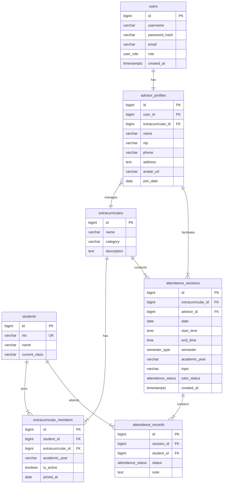

# Database Schema: Extracurricular Advisor (PostgreSQL)

Document ini menjelaskan rancangan skema database PostgreSQL untuk mendukung fitur **Tutor Ekstrakurikuler**. Skema ini dirancang agar kompatibel dengan [API Documentation](./api-docs.md).

## Entity Relationship Diagram (ERD)



## Enum Types Definition

Sebelum membuat tabel, definisikan tipe ENUM berikut di PostgreSQL:

```sql
CREATE TYPE user_role AS ENUM ('admin', 'student', 'tutor_ekskul');
CREATE TYPE attendance_status AS ENUM ('hadir', 'sakit', 'izin', 'alpa');
CREATE TYPE semester_type AS ENUM ('Ganjil', 'Genap');
```

## Table Specifications

### 1. Users & Profiles

Tabel utama untuk manajemen akun dan profil detil tutor.

| Table                | Column             | Postgres Type | Constraints                | Description                     |
| -------------------- | ------------------ | ------------- | -------------------------- | ------------------------------- |
| **users**            | id                 | BIGSERIAL     | PK                         | Unique ID (Auto Increment)      |
|                      | username           | VARCHAR(50)   | UNIQUE                     | Login identifier (NIP/Username) |
|                      | email              | VARCHAR(100)  | UNIQUE                     | Email untuk reset password      |
|                      | password_hash      | VARCHAR(255)  | NOT NULL                   | Bcrypt hash                     |
|                      | role               | user_role     | NOT NULL                   | Custom Enum Type                |
|                      | created_at         | TIMESTAMPTZ   | DEFAULT NOW()              | Waktu pembuatan akun            |
| **advisor_profiles** | id                 | BIGSERIAL     | PK                         |                                 |
|                      | user_id            | BIGINT        | FK -> users(id)            | Relasi ke akun                  |
|                      | extracurricular_id | BIGINT        | FK -> extracurriculars(id) | Ekskul yang diampu              |
|                      | name               | VARCHAR(100)  | NOT NULL                   | Nama Lengkap dengan gelar       |
|                      | nip                | VARCHAR(20)   |                            | Nomor Induk Pegawai             |
|                      | phone              | VARCHAR(20)   |                            |                                 |
|                      | address            | TEXT          |                            |                                 |
|                      | avatar_url         | VARCHAR(255)  |                            | URL foto profil                 |
|                      | join_date          | DATE          |                            | Tanggal bergabung               |

### 2. Extracurriculars & Members

Manajemen data master ekskul dan anggotanya per tahun ajaran.

| Table                       | Column             | Postgres Type | Constraints                | Description                      |
| --------------------------- | ------------------ | ------------- | -------------------------- | -------------------------------- |
| **extracurriculars**        | id                 | BIGSERIAL     | PK                         |                                  |
|                             | name               | VARCHAR(50)   | NOT NULL                   | Nama Ekskul (Pramuka, dll)       |
|                             | category           | VARCHAR(50)   |                            | Kategori (Olahraga, Seni)        |
|                             | description        | TEXT          |                            | Deskripsi singkat                |
| **students**                | id                 | BIGSERIAL     | PK                         |                                  |
|                             | nis                | VARCHAR(20)   | UNIQUE                     | Nomor Induk Siswa                |
|                             | name               | VARCHAR(100)  | NOT NULL                   | Nama Siswa                       |
|                             | current_class      | VARCHAR(20)   | NOT NULL                   | Kelas saat ini                   |
| **extracurricular_members** | id                 | BIGSERIAL     | PK                         |                                  |
|                             | student_id         | BIGINT        | FK -> students(id)         |                                  |
|                             | extracurricular_id | BIGINT        | FK -> extracurriculars(id) |                                  |
|                             | academic_year      | VARCHAR(9)    | NOT NULL                   | Tahun Ajaran (e.g., '2025/2026') |
|                             | is_active          | BOOLEAN       | DEFAULT TRUE               | Status keanggotaan aktif         |
|                             | joined_at          | DATE          | DEFAULT CURRENT_DATE       | Tanggal bergabung member         |

### 3. Attendance (Presensi)

Pencatatan kegiatan dan kehadiran siswa.

| Table                   | Column             | Postgres Type     | Constraints                   | Description                         |
| ----------------------- | ------------------ | ----------------- | ----------------------------- | ----------------------------------- |
| **attendance_sessions** | id                 | BIGSERIAL         | PK                            | Representasi satu pertemuan         |
|                         | advisor_id         | BIGINT            | FK -> advisor_profiles(id)    | Tutor yang mengajar                 |
|                         | extracurricular_id | BIGINT            | FK -> extracurriculars(id)    | Relasi ke ekskul                    |
|                         | date               | DATE              | NOT NULL                      | Tanggal kegiatan                    |
|                         | start_time         | TIME              | NOT NULL                      | Waktu mulai                         |
|                         | end_time           | TIME              | NOT NULL                      | Waktu selesai                       |
|                         | semester           | semester_type     | NOT NULL                      | Enum: 'Ganjil'/'Genap'              |
|                         | academic_year      | VARCHAR(9)        | NOT NULL                      | Tahun Ajaran                        |
|                         | topic              | VARCHAR(255)      |                               | Topik/Materi kegiatan               |
|                         | tutor_status       | attendance_status | NOT NULL                      | Kehadiran tutor itu sendiri         |
|                         | created_at         | TIMESTAMPTZ       | DEFAULT NOW()                 | Audit log waktu input               |
| **attendance_records**  | id                 | BIGSERIAL         | PK                            | Detail per siswa                    |
|                         | session_id         | BIGINT            | FK -> attendance_sessions(id) | On Delete Cascade                   |
|                         | student_id         | BIGINT            | FK -> students(id)            |                                     |
|                         | status             | attendance_status | NOT NULL                      | Enum: 'hadir','sakit','izin','alpa' |
|                         | note               | TEXT              |                               | Catatan (misal: "Sakit demam")      |

## Implementation Notes (PostgreSQL Specific)

1.  **Custom Types**: Gunakan `CREATE TYPE` untuk enum agar integritas data terjamin dan performa lebih baik daripada string check constraint.
2.  **Date/Time**: Gunakan `TIMESTAMPTZ` untuk menyimpan waktu absolut (UTC) agar aman jika server berbeda zona waktu. Gunakan `DATE` dan `TIME` untuk jadwal yang bersifat lokal.
3.  **Performance Indexes**:
    - Index pada `extracurricular_members(student_id, extracurricular_id)` untuk lazy loading profil siswa.
    - Index pada `attendance_sessions(date)` untuk mempercepat filtering history.
    - Index pada `attendance_records(session_id)` untuk join cepat saat mengambil detail presensi.
